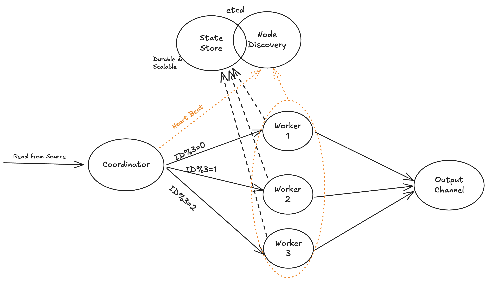

# Streame

- [Streame](#streame)
  - [Status Tracker](#status-tracker)
  - [Benchmarks](#benchmarks)
  - [Architecture](#architecture)
  - [Available Functionalities](#available-functionalities)
  - [Examples](#examples)
    - [Standalone (Non-Distributed) Mode](#standalone-non-distributed-mode)
    - [Distributed Mode](#distributed-mode)
  - [Final Workflow Expectations](#final-workflow-expectations)
  - [CNCF Alignment](#cncf-alignment)
  - [Contributions](#contributions)

Streame is going to be a fault tolerant stream processor, Eventually!

## Status Tracker
You can track the roadmap and in-progress features of Streame
on [Streame Status Tracker](https://github.com/users/farbodahm/projects/1).

## Benchmarks
Streame emphasizes the importance of benchmarks, as nothing is reliable
without numbers.

Each core functionality will have benchmark tests in `benchmarks` module.
These benchmarks are integrated into our CI process, ensuring automatic
execution.

Additionally, detailed SVG reports on Memory and CPU performance,
generated using pprof, are automatically uploaded to the artifacts
section of each CI pipeline run.

## Architecture

Streame is built around the `StreamDataFrame` abstraction, which wires a sequence
of processing stages operating on unbounded record streams. Each stage
transforms, filters, or enriches records according to the pipeline schema.

In **standalone mode**, all stages run concurrently within the same process.
In **distributed mode**, Streame leverages etcd for node discovery and leader
election; the leader streams records to followers over gRPC.




## Available Functionalities

- [x] Schema Validation
- [x] Filter
- [x] Select
- [x] Add static column
- [x] Add column rename
- [x] Join
- [ ] Aggregation

## Examples

### Standalone (Non-Distributed) Mode

```go
package main

import (
    "context"
    "fmt"
    "log"
    "time"

    "github.com/farbodahm/streame/pkg/core"
    "github.com/farbodahm/streame/pkg/functions"
    . "github.com/farbodahm/streame/pkg/types"
)

func main() {
    input := make(chan Record)
    output := make(chan Record)
    errors := make(chan error)

    schema := Schema{Columns: Fields{"value": IntType}}
    s := core.NewStreamDataFrame(input, output, errors, schema, "local-stream", nil)
    sdf := s.Filter(functions.Filter{ColumnName: "value", Operator: functions.NOT_EQUAL, Value: "10"})

    if err := sdf.Execute(context.Background()); err != nil {
        log.Fatalf("Failed to execute StreamDataFrame: %v", err)
    }
}
```

### Distributed Mode

```go
package main

import (
    "context"
    "log"
    "time"

    "github.com/farbodahm/streame/pkg/core"
    "github.com/farbodahm/streame/pkg/functions"
    . "github.com/farbodahm/streame/pkg/types"
    clientv3 "go.etcd.io/etcd/client/v3"
)

func main() {
    endpoints := []string{"http://localhost:2380"}
    cli, err := clientv3.New(clientv3.Config{
        Endpoints:   endpoints,
        DialTimeout: 6 * time.Second,
    })
    if err != nil {
        log.Fatalf("[%s] Failed to connect: %v", endpoints, err)
    }
    defer cli.Close()

    input := make(chan Record)
    output := make(chan Record)
    errors := make(chan error)

    schema := Schema{
        Columns: Fields{
            "value": IntType,
        },
    }
    s := core.NewStreamDataFrame(input, output, errors, schema, "test-stream", cli, core.WithNodeIP("localhost"))

    sdf := s.Filter(functions.Filter{ColumnName: "value", Operator: functions.NOT_EQUAL, Value: "10"})

    ctx := context.Background()
    if err := sdf.Execute(ctx); err != nil {
        log.Fatalf("Failed to start StreamDataFrame: %v", err)
    }
}
```

## Final Workflow Expectations

Thinking loudly, here I will write all of the requirements that I
expect to be added to the main framework somewhere in the future
shortly after having the main functionalities in place.

- Orchestration (Ex. K8S, DockerSwarm, …)
- Monitoring
- Unit & Integration tests
- Load Test (Ex. K6S)
- Fault Tolerance Test (Ex. chaos-mesh)

## CNCF Alignment

Streame is aligned with the CNCF ecosystem and leverages CNCF-hosted projects
such as etcd, Kubernetes, Prometheus, and gRPC to deliver a cohesive streaming platform.


## Contributions

This project is getting started as fun and for learning; and it may
end up in something important to be used on Production; So feel free
to contribute to it as you like ;)
You can find the roadmap [here](https://github.com/users/farbodahm/projects/1).
